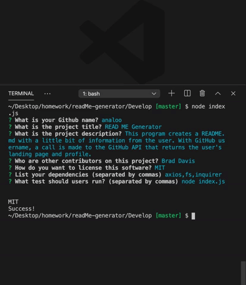

# READ ME Generator READ ME
        
## Summary
        
This program creates a README.md with a little bit of information from the user. With GitHub username, a call is made to the GitHub API that returns the user's landing page and profile.

 


## Site Image



## Table of Contents

- [Installation](#Installation)
- [Usage](#Usage)
- [License](#License)
- [Contributing](#Contributing)
- [Tests](#Tests)
- [Author](#Author)
        
        
## Installation
```
npm install axios
npm install fs
npm install inquirer

```
        
        
## Usage
use the package manager [npm]("https://nodejs.org/en/knowledge/getting-started/npm/what-is-npm/") to install the dependancies

## Dependencies
```
axios
fs
inquirer
```
        
        
## License

            
MIT
        
         
## Contributors
            
Brad Davis
        
        
## Tests
```
node index.js
```
        
        
## Author
[GitHub](https://github.com/analoo)


       
        
